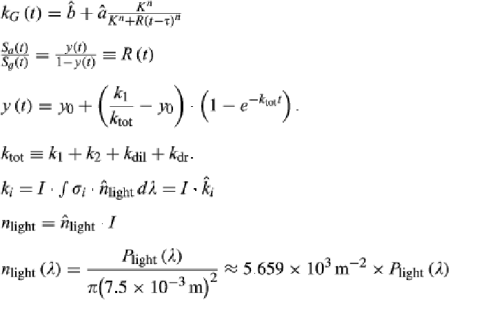

[Full Paper](https://www.embopress.org/doi/10.15252/msb.20167456)
[Supplementary methods](https://www.embopress.org/action/downloadSupplement?doi=10.15252%2Fmsb.20167456&file=msb167456-sup-0001-Appendix.pdf), check methods 1&2

Plight of an LED calculated using data collected via supplementary method 3.  
There are some given LEDs in dataset ev3/ reference data/ .irr files as text documents.  
Table ev1 has names and manufacturers of those leds above (if we want to get one of those instead of measuring our own Plight using S3).  

7.5 in the last equation above is the radius of the well in which their media was. (what will that be for us?)  
Also, our media isn’t transparent, which is an assumption they make to simplify that equation.  
Probably σ a and g are available in some dataset (maybe EV7). (this would be a function of wavelength, applicable to cph8 activation)  
That is how you get k1 & k2 and therefore, ktot (since other parameters from the paper are unchanged), y(t), and R(t).  

Boundaries for non-linear regression from experimental data listed in table ev4  
**Dataset EV7 has the code for model fitting (as an .ipynb) and all the graphs under the cph8 analysis folder**  